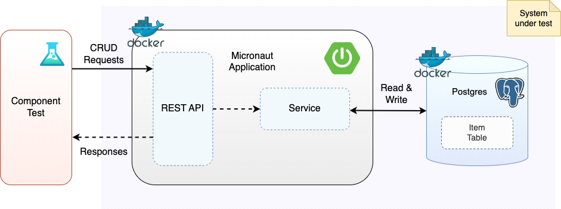

# Spring Boot Demo With React Front End

## Overview

Spring Boot application with a React front end that allows the user to list, add, edit and delete items.

The Spring Boot application uses Postgres as the datatabase for persisting the items.  The React application provides a UI to perform the create, read, update and delete (CRUD) operations.


## Screenshots

- Home page:


- List items:


- Add item:


## Run Demo

The steps to run the demo are described here.  See the sections below for more detail on the React and Spring Boot applications.

In the project root run:
```
mvn clean install
docker-compose up -d
java -jar target/springboot-react-1.0.0.jar
```

In a second terminal window:
```
cd frontend
npm install --save bootstrap@5.1 react-cookie@4.1.1 react-router-dom@5.3.0 reactstrap@8.10.0
npm start
```

Navigate to: http://localhost:3000/

## React Application (Front End)

The React application is based on the Baeldung tutorial [here](https://www.baeldung.com/spring-boot-react-crud).

The React skeleton application is created in the root of the Spring Boot application with the following commands:

```
npx create-react-app frontend
cd frontend
npm install --save bootstrap@5.1 react-cookie@4.1.1 react-router-dom@5.3.0 reactstrap@8.10.0
```

It uses Bootstrap's CSS and reactstrap's components for the UI, with React Router components for navigating around the application.

To start the React application, in the `\frontend` directory:

```
npm start
```

Ensure the Spring Boot application is running, then navigate to: http://localhost:3000/

## Spring Boot Application (Back End)

Build Spring Boot application with Java 17:
```
mvn clean install
```

Start Docker containers:
```
docker-compose up -d
```

Start Spring Boot application:
```
java -jar target/springboot-react-1.0.0.jar
```

The application endpoints can be hit without the front end application running, by using `curl`.

In a terminal window use curl to submit a POST REST request to the application to create an item:
```
curl -i -X POST localhost:9001/v1/items -H "Content-Type: application/json" -d '{"name": "test-item", "colour": "red"}'
```

A response should be returned with the 201 CREATED status code and the new item id in the Location header:
```
HTTP/1.1 201 
Location: 7c738768-7c29-43f4-bb39-e1638cffe97f
```

The Spring Boot application should log the successful item persistence:
```
Item created with id: 7c738768-7c29-43f4-bb39-e1638cffe97f
```

Get the item that has been created using curl:
```
curl -i -X GET localhost:9001/v1/items/7c738768-7c29-43f4-bb39-e1638cffe97f
```

A response should be returned with the 200 SUCCESS status code and the item in the response body:
```
HTTP/1.1 200 
Content-Type: application/json
Transfer-Encoding: chunked
Date: Sat, 28 Oct 2023 15:19:36 GMT

{"id":"7c738768-7c29-43f4-bb39-e1638cffe97f","name":"test-item","colour":"red"}
```

In a terminal window use curl to submit a PUT REST request to the application to update the item colour:
```
curl -i -X PUT localhost:9001/v1/items/7c738768-7c29-43f4-bb39-e1638cffe97f -H "Content-Type: application/json" -d '{"name": "test-item", "colour": "blue"}'
```

A response should be returned with the 204 NO CONTENT status code:
```
HTTP/1.1 204 
```

The Spring Boot application should log the successful update of the item:
```
Item updated with id: 7c738768-7c29-43f4-bb39-e1638cffe97f - name: test-item - colour: blue
```

Get all items that have been created using curl:
```
curl -i -X GET localhost:9001/v1/items
```

Delete the item using curl:
```
curl -i -X DELETE localhost:9001/v1/items/7c738768-7c29-43f4-bb39-e1638cffe97f
```

The Spring Boot application should log the successful deletion of the item:
```
Deleted item with id: 7c738768-7c29-43f4-bb39-e1638cffe97f
```

Stop containers:
```
docker-compose down
```

## Component Tests

The component test tests the Spring Boot application reading and writing records via the REST API.



For more on the component tests see: https://github.com/lydtechconsulting/component-test-framework

Build Spring Boot application jar:
```
mvn clean install
```

Build Docker container:
```
docker build -t ct/springboot-react:latest .
```

Run tests:
```
mvn test -Pcomponent
```

Run tests leaving containers up:
```
mvn test -Pcomponent -Dcontainers.stayup
```

Manual clean up (if left containers up):
```
docker rm -f $(docker ps -aq)
```

## Docker Clean Up

Manual clean up (if left containers up):
```
docker rm -f $(docker ps -aq)
```

Further docker clean up if network/other issues:
```
docker system prune
docker volume prune
```
